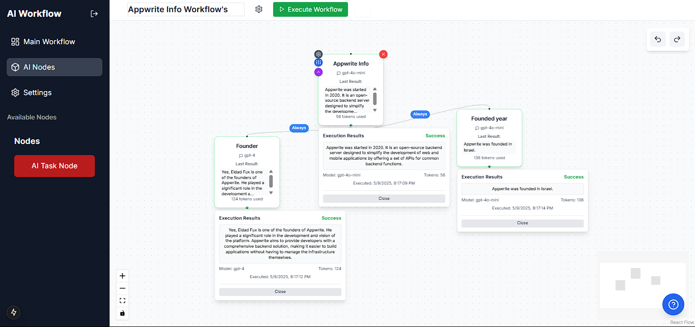

# 🔮 AI Workflow Builder

A powerful and intuitive visual workflow builder for AI tasks, built with Next.js, React Flow, and Appwrite.

## ✨ Features

### 🎯 Core Features
- **Visual Workflow Builder**: Drag-and-drop interface for creating AI workflows
- **AI Task Nodes**: Configure and chain multiple AI operations
- **Real-time Execution**: Watch your workflow execute in real-time
- **Smart Routing**: Conditional paths based on task success/failure
- **History Management**: Undo/redo support for all actions

### 🛠️ Technical Features
- **Authentication**: Secure user management with Appwrite
- **API Key Management**: Secure storage of API keys
- **State Management**: Efficient state handling with Zustand
- **Auto-save**: Automatic saving of workflows
- **Responsive Design**: Full mobile and desktop support

## 🚀 Getting Started

### Prerequisites
- Node.js 18+ installed
- Appwrite instance setup
- OpenAI API key (for AI tasks)

### Installation

1. Clone the repository:
```powershell
git clone https://github.com/yourusername/ai-workflow-builder.git
cd ai-workflow-builder
```

2. Install dependencies:
```powershell
npm install
```

3. Configure environment variables:
```env
DATABASE_ID=your_database_id
MAIN_WORKFLOW_ID=your_workflow_collection_id
COLLECTION_WORKFLOW_EXECUTION=your_execution_collection_id
```

4. Run the development server:
```powershell
npm run dev
```

5. Open [http://localhost:3000](http://localhost:3000) to see the app

## 🏗️ Project Structure

```
src/
├── app/                  # Next.js app router
├── components/          # React components
│   ├── nodes/          # Custom workflow nodes
│   └── others/         # Utility components
├── config/             # Configuration files
├── lib/                # Core logic
│   ├── aiTaskHandler.ts    # AI task execution
│   ├── appwrite.ts        # Appwrite setup
│   └── workflowExecutor.ts # Workflow engine
├── store/              # State management
└── types/              # TypeScript definitions
```

## 🎮 Usage Guide

1. **Create Account/Login**: Start by creating an account or logging in
2. **Configure API Keys**: Add your OpenAI API key in settings
3. **Build Workflow**: 
   - Drag AI nodes from sidebar
   - Connect nodes to create flow
   - Configure each node's parameters
4. **Execute Workflow**: 
   - Click "Execute" to run
   - Monitor real-time progress
   - View results in each node

## 🔧 Advanced Features

### AI Task Configuration
- **Model Selection**: Choose from various AI models
- **Parameter Control**: Adjust tokens, temperature
- **Context Management**: Chain prompts between nodes

### Workflow Management
- **Auto-save**: Changes saved automatically
- **Version History**: Track workflow changes
- **Export/Import**: Share workflows (coming soon)

## 🛡️ Security Features

- Secure API key storage
- User authentication
- Permission-based access control
- Data encryption at rest


## 📄 License

This project is licensed under the MIT License - see the [LICENSE](LICENSE) file for details.

## 🙏 Acknowledgments

- [Next.js](https://nextjs.org) - React Framework
- [React Flow](https://reactflow.dev) - Workflow visualization
- [Appwrite](https://appwrite.io) - Backend services
- [OpenAI](https://openai.com) - AI capabilities
- [TailwindCSS](https://tailwindcss.com) - Styling
